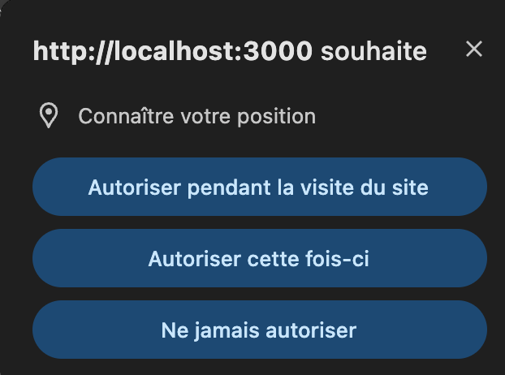
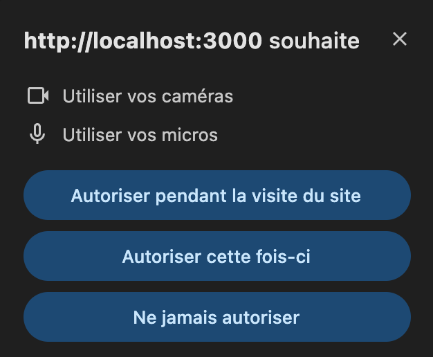
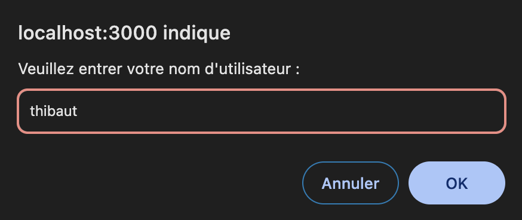
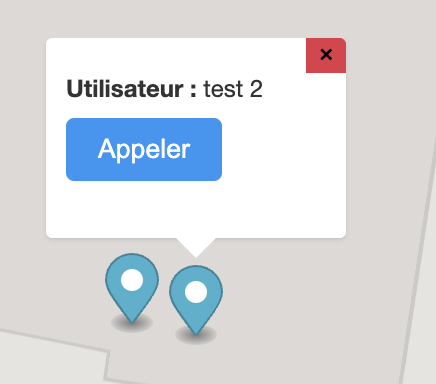
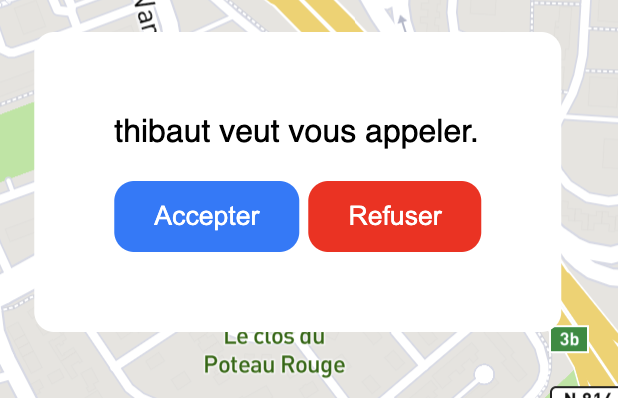
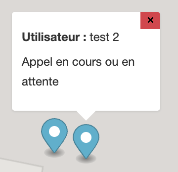

# Application de Géolocalisation et Communication en Temps Réel

## Description
Application web permettant aux utilisateurs de se géolocaliser sur une carte en temps réel et d'établir des appels vidéo entre utilisateurs.

## Démonstration de l'application

https://github.com/user-attachments/assets/214b7129-7d78-4b82-971b-57b79e318f04

## Lien de l'application

[GeoGlitch](https://thibaut.lefevre.caen.mds-project.fr/)

## Architecture Technique

### Frontend
- Interface utilisateur construite en HTML/CSS/JavaScript vanilla
- Utilisation de Mapbox GL JS pour l'affichage de la carte
- Gestion des connexions WebSocket pour les mises à jour en temps réel
- Implémentation WebRTC pour les appels audio/vidéo

### Backend
- Serveur Node.js avec Express
- Serveur WebSocket pour la communication en temps réel
- Gestion des salles et des utilisateurs en mémoire

### Flux de Communication
1. **WebSocket** :
   - Gestion des positions des utilisateurs
   - Mise à jour en temps réel des positions sur la carte
   - Gestion des salles (création, rejoindre, quitter)
   - Signalement des appels

2. **WebRTC** :
   - Établissement des connexions peer-to-peer
   - Échange des flux audio/vidéo
   - Utilisation du serveur WebSocket pour la signalisation

3. **APIs Navigator** :
   - Géolocalisation via `navigator.geolocation`
   - Détection des mouvements via l'API Accelerometer

## Dépendances

### Frontend
- Mapbox GL JS
- Aucune autre dépendance externe (vanilla JavaScript)

### Backend
```json
{
   "express": "^4.21.2",
   "ws": "^8.18.0"
}
```
## Installation

1. Sur un VPS : Suivre les instructions présentes dans la [documentation](./documentation//deploiement-vps.md)

2. En local : 
Faire un git clone du projet, ajouter les fichiers `server/config.private.js` et `client/scripts/config.private.js` à partir des fichiers templates correspondants

## Lancement de l'Application

1. Démarrer le serveur en local :

```bash
npm start
```


2. Accéder à l'application :
   - Ouvrir un navigateur moderne (Chrome, Firefox, Edge, Safari...) afin d'avoir accès à la fonctionnalité de WebRTC
   - Accéder à `http://localhost:3000`

## Fonctionnalités Principales

### Géolocalisation
- Utilisation de l'API Geolocation pour obtenir la position
- Mise à jour en temps réel sur la carte
- Détection des mouvements via l'accéléromètre

### Appels Audio/Vidéo
- Établissement de connexions WebRTC
- Gestion des flux média
- Interface d'appel/réponse

## Structure du Projet
```plaintext
├── server/
│ ├──  config.private.js # Configuration privée du serveur
│ └── config.template.js # Configuration du serveur (modèle)
│ └── index.js # Point d'entrée du serveur
│ └── server.js # Serveur Express
│ └── websocket.js # Gestion des WebSocket
|
├── client/
│ ├── scripts/
│ │ ├── call.js # Gestion des appels
│ │ ├── config.private.js # Configuration privée du client
│ │ ├── config.template.js # Configuration du client (modèle)
│ │ ├── main.js # Point d'entrée du client
│ │ ├── map.js # Gestion de la carte
│ │ └── websocket.js # Client WebSocket
|
│ ├── styles/
│ │ └── style.css # Styles de l'application
|
│ └── index.html # Page principale
|
└── package.json
```

## Notes Techniques

### WebSocket
- Connexion établie au chargement de la page
- Gestion des événements : position, rooms, calls
- Reconnexion automatique en cas de déconnexion

### WebRTC
- Utilisation de STUN/TURN pour la traversée NAT
- Échange des candidats ICE via WebSocket
- Gestion des flux média (audio/vidéo)


## Documentation technique


## Guide Utilisateur

### Premier Démarrage
1. À l'ouverture de l'application, puis en fonction de vos actions, votre navigateur vous demandera l'autorisation d'accéder à :
   - Votre position géographique
   - Votre caméra et microphone (pour les appels)
   - Les données de l'accéléromètre (sur mobile)



Il vous demandera de choisir un nom d'utilisateur.


### Navigation et Interaction
- **Déplacement sur la carte** : 
  - Zoom : molette de la souris ou pincement sur mobile
  - Déplacement : clic-glisser ou glissement du doigt

- **Appels Audio/Vidéo** :
  1. Cliquez sur le bouton "Appeler" sur le point d'un utilisateur

  2. L'autre utilisateur reçoit une notification

  3. Une fois accepté, la vidéo s'affiche en dessous de la carte et la modal se met à jour

  4. Contrôles disponibles : raccrocher


### Fonctionnalités Mobile
  - Affiche les mouvements de l'appareil en temps réel ainsi que son altitude

### Compatibilité
- **Navigateurs supportés** :
  - Chrome (Desktop & Mobile) : toutes fonctionnalités
  - Firefox : tout sauf accéléromètre
  - Safari : support limité WebRTC
  - Edge : support complet

## Limitations Connues
- Support navigateur limité pour certaines fonctionnalités

### Résolution des Problèmes
1. **Position non détectée** :
   - Vérifiez les permissions du navigateur
   - Activez le GPS sur mobile
   - Essayez de recharger la page

2. **Problèmes d'Appel** :
   - Vérifiez votre connexion internet
   - Assurez-vous que caméra/micro sont autorisés
   - Réessayez l'appel après quelques secondes

3. **Déconnexions Fréquentes** :
   - Vérifiez votre connexion internet
   - Fermez les autres onglets consommateurs
   - Utilisez un réseau plus stable